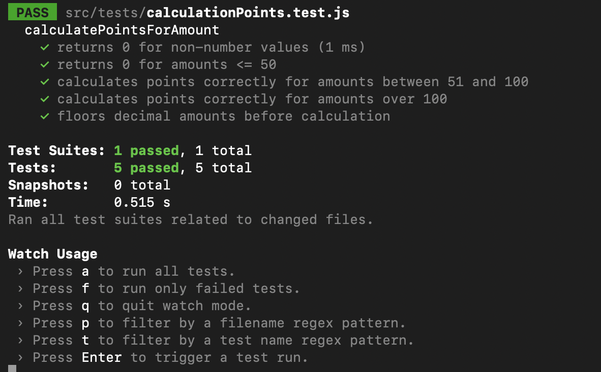

# Transaction-Rewards-App

A React-based reward points calculation system where customers earn points based on their transactions.

## Project Overview

- **All Transactions List**: Displays details of transactions like Transaction ID, date, customer name, transaction amount, transaction reward points that customer get for particulat transaction.
- **All Customers List**: Displays details of Customer like Customer ID, customer name, total rewards points.
- **View Button**: On view button click Modal will open.
- **Modal**: Modal diplay the details about customer, total rewards points and monthly breakdown transactions.

## 🛠️ Installation & Setup

Follow these steps to run the project locally:

1. Clone the repository**

```sh
git clone https://github.com/faizeeBano/Transaction-Rewards-App
cd Transaction-Rewards-App

```

2. Install dependencies

```sh
npm install
```

3. Start the development server

```sh
npm start
```

This will start the development server, and the app will be available at http://localhost:3000.

### Running Tests

```sh
npm test
```

## Technologies Used

- **React.js** for building the user interface.
- **Prettier** for automatic code formatting.
- **Babel** for transpiling modern JavaScript and JSX syntax.
- **PropTypes** for type-checking React props.
- **JavaScript (ES6+)** for writing effiecnt and modern JavaScript code.

## Key Components

- `src/index.js`: Entry point of the React application.
- `src/App.js`: Main component where all Components are gather
- `src/components/transactions/Table`: Component to display All transaction.
- `src/components/common/Pagination`: Component for pagination.
- `src/components/customers/Table`: Component to display All customer.
- `src/components/common/filterPannel`: Component for Filter that we can use in customer table.
- `src/components/common/Modal`: Component for Model that used to diplay details.

## Project Images

1. Header Part


2. Transactions List with Pagination


3. Customers list with Filter


4. Modal


5. Footer


6. Test Cases



### 🙌 Thank You for Checking Out the Rewards App!
